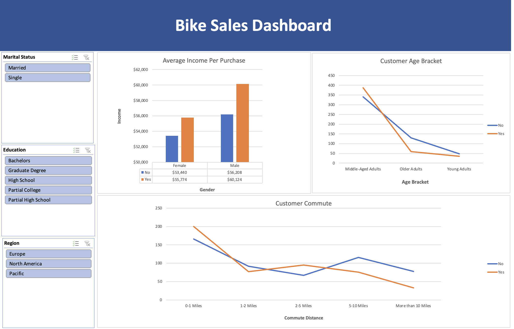

# bike-sales-analysis-excel
## Objective
To analyze customer demographic data and purchasing patterns in a bike sales dataset, and derive actionable business insights using Microsoft Excel.

---

## Tools Used
- **Microsoft Excel**
  - PivotTables
  - PivotCharts
  - Conditional Formatting
  - IF, VLOOKUP, COUNTIF functions
  - Slicers and Dynamic Dashboards

   
 ## Key Insights

- **Married customers** were more likely to purchase bikes than single customers.
- Customers with **higher income levels** and **advanced education** were more likely to purchase bikes.
- People **living closer to work** had a higher likelihood of buying bikes.
- Target demographics: **Married, working professionals aged 30–40** with **graduate-level education**.

   
## Dashboard Highlights
- **Dynamic filtering** by marital status, region, and education.
- Sales trends segmented by **income**, **age**, and **customer commute**.
- KPI snapshots for **total sales**, **customer conversion rate**, and **regional performance**.

## 📸 Excel Dashboard   
  

 
## Conclusion

This project showcases how Excel can be used effectively for sales analytics and customer segmentation without the need for advanced programming. It forms a foundational skillset for data-driven decision making in business environments.

## 📬 Let's Connect!
If you're a recruiter or someone interested in collaborating, feel free to reach out or connect with me on [LinkedIn](https://www.linkedin.com/in/sulemantheanalyst).
